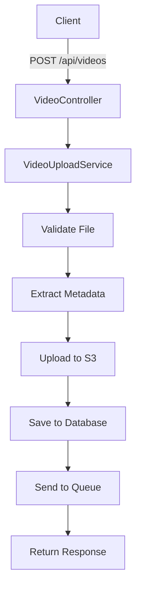

# 🎬 Sistema de Upload de Vídeos

[](https://php.net)
[](https://laravel.com)
[](https://aws.amazon.com/s3/)
[](./tests)

**Sistema completo para fazer upload de vídeos**.

> 💡 **Para iniciantes:** Este sistema permite que você envie vídeos pela internet e os armazene na nuvem (AWS S3) de forma segura e organizada.

## 🚀 O que este sistema faz?

✅ **Upload de vídeos** - Envie vídeos MP4, MOV, AVI e outros formatos  
✅ **Armazenamento seguro** - Seus vídeos ficam salvos na nuvem AWS  
✅ **Organização automática** - Lista e organiza todos os vídeos  
✅ **Informações dos vídeos** - Mostra duração, tamanho e resolução  
✅ **API completa** - Interface para desenvolvedores

## 📋 Guia Rápido

- [🎯 **Como usar (Postman)**](#-como-testar-upload) ⭐ **Comece aqui!**
- [⚡ **Instalação simples**](#-instalação)
- [⚙️ **Configuração básica**](#️-configuração)
- [🎯 **Todas as funcionalidades**](#-api-endpoints)
- [❓ **Problemas e soluções**](#-faq-e-troubleshooting)

## 🚀 Funcionalidades

### Core Features
- ✅ **Upload de vídeos** para AWS S3 com validação rigorosa
- ✅ **Extração de metadados** automática (FFmpeg/Mock)
- ✅ **API REST completa** (CRUD operations)
- ✅ **Sistema de filas** para processamento assíncrono
- ✅ **Validação de arquivos** (tipo, tamanho, integridade)
- ✅ **UUIDs únicos** para identificação segura

### Arquitetura & Qualidade
- ✅ **Arquitetura SOLID** implementada com interfaces
- ✅ **Injeção de dependências** configurada
- ✅ **Testes automatizados** (PHPUnit)
- ✅ **Tratamento de erros** robusto
- ✅ **Logs estruturados** para debugging
- ✅ **Rollback automático** em caso de falhas

## 🛠️ Tecnologias

| Categoria | Tecnologia | Versão | Descrição |
|-----------|------------|--------|-----------|
| **Backend** | PHP | 8.2+ | Linguagem principal |
| **Framework** | Laravel | 12.x | Framework web moderno |
| **Storage** | AWS S3 | Latest | Armazenamento de vídeos |
| **Database** | MySQL | 8.0+ | Banco de dados relacional |
| **Media** | FFmpeg | Latest | Processamento de vídeos |
| **Queue** | Laravel Queue | Built-in | Sistema de filas |
| **Testing** | PHPUnit | 11.x | Testes automatizados |

## ⚡ Instalação

> 🎯 **Objetivo:** Colocar o sistema funcionando em 5 minutos

### 📋 Você precisa ter instalado:

- **PHP 8.2+** ([Download aqui](https://www.php.net/downloads))
- **Composer** ([Download aqui](https://getcomposer.org/download/))
- **MySQL/XAMPP** ([Download XAMPP](https://www.apachefriends.org/))
- **Conta AWS** com S3 ([Criar conta](https://aws.amazon.com/pt/s3/))

### 🚀 Instalação em 5 passos:

```bash
# 1️⃣ Clone o projeto
git clone https://github.com/EmanuelSgx/projeto-video.git
cd projeto-video

# 2️⃣ Instale as dependências
composer install

# 3️⃣ Configure o ambiente
copy .env.example .env
php artisan key:generate

# 4️⃣ Configure banco de dados (veja próxima seção)

# 5️⃣ Inicie o servidor
php artisan migrate
php artisan serve
```

✅ **Pronto!** Acesse: `http://localhost:8000`

## ⚙️ Configuração

> 🎯 **Objetivo:** Configurar banco de dados e AWS em 3 minutos

### 1️⃣ Abra o arquivo `.env` e configure:

```env
# 📊 BANCO DE DADOS (MySQL/XAMPP)
DB_DATABASE=video_upload_db
DB_USERNAME=root
DB_PASSWORD=sua_senha

# ☁️ AWS S3 (OBRIGATÓRIO para upload)
AWS_ACCESS_KEY_ID=sua_access_key
AWS_SECRET_ACCESS_KEY=sua_secret_key
AWS_DEFAULT_REGION=sa-east-1
AWS_BUCKET=seu-bucket-videos
```

### 2️⃣ Como obter credenciais AWS:

1. Entre na [AWS Console](https://console.aws.amazon.com/)
2. Vá em **IAM** → **Users** → **Create User**
3. Dê permissões de **S3** para o usuário
4. Copie **Access Key** e **Secret Key**
5. Crie um **Bucket S3** e anote o nome

### 3️⃣ Finalize a configuração:

```bash
# Crie o banco de dados
php artisan migrate
```

✅ **Configuração completa!**

## 🎯 O que você pode fazer

> 🎯 **Todas as funcionalidades disponíveis**

| ✨ Ação | 🌐 Endpoint | 📝 Descrição |
|---------|-------------|--------------|
| 📤 **Fazer upload** | `POST /api/videos` | Enviar um vídeo |
| 📋 **Ver todos os vídeos** | `GET /api/videos` | Listar vídeos enviados |
| 🔍 **Ver um vídeo** | `GET /api/videos/{id}` | Detalhes de um vídeo |
| 🗑️ **Apagar vídeo** | `DELETE /api/videos/{id}` | Remover vídeo |
| ✅ **Testar conexão** | `GET /api/videos/validate/s3` | Verificar se está funcionando |

### 📁 Tipos de vídeo aceitos:
✅ **MP4** | ✅ **MOV** | ✅ **AVI** | ✅ **WEBM** | ✅ **WMV**

### 📏 Limites:
- **Tamanho máximo:** 100MB por vídeo
- **URL base:** `http://localhost:8000/api`

## 📤 Como Testar Upload

> 🎯 **Guia passo a passo para enviar seu primeiro vídeo**

### 🔧 Usando Postman (Recomendado)

#### 1️⃣ Configure o Postman:
- **Método:** `POST`
- **URL:** `http://127.0.0.1:8000/api/videos`

#### 2️⃣ Adicione os Headers necessários:
```
Accept: application/json
X-Requested-With: XMLHttpRequest
```

> ⚠️ **IMPORTANTE:** NÃO adicione `Content-Type` - o Postman faz isso automaticamente!

#### 3️⃣ Selecione o arquivo:
1. Vá na aba **Body**
2. Escolha **form-data**
3. Adicione um campo:
   - **Key:** `video` (tem que ser exatamente assim)
   - **Tipo:** **File** (não Text!)
   - **Value:** Clique em "Select Files" e escolha seu vídeo

#### 4️⃣ Clique em **Send**!

### ✅ Resposta de sucesso:
```json
{
    "success": true,
    "data": {
        "uuid": "abc-123-def",
        "original_name": "meu-video.mp4",
        "status": "uploaded"
    },
    "message": "Video uploaded successfully"
}
```

### 💻 Usando Terminal (Alternativa):

```powershell
# Windows PowerShell
curl -X POST "http://127.0.0.1:8000/api/videos" `
  -H "Accept: application/json" `
  -H "X-Requested-With: XMLHttpRequest" `
  -F "video=@C:\caminho\para\video.mp4"
```

## 📊 Exemplos de Uso

### 1. Upload de Vídeo

**Request:**
```bash
curl -X POST http://localhost:8000/api/videos \
  -F "video=@meu-video.mp4" \
  -H "Accept: application/json" \
  -H "X-Requested-With: XMLHttpRequest"
```

**Response (201 Created):**
```json
{
  "success": true,
  "data": {
    "id": 1,
    "uuid": "550e8400-e29b-41d4-a716-446655440000",
    "original_name": "meu-video.mp4",
    "resolution": "1920x1080",
    "duration": 120,
    "formatted_duration": "00:02:00",
    "file_size": 15728640,
    "formatted_file_size": "15.00 MB",
    "mime_type": "video/mp4",
    "status": "uploaded",
    "s3_path": "https://bucket.s3.region.amazonaws.com/videos/uuid/file.mp4",
    "created_at": "2025-06-04T17:00:00.000000Z"
  },
  "message": "Video uploaded successfully"
}
```

### 2. Listar Vídeos

**Request:**
```bash
curl -X GET http://localhost:8000/api/videos \
  -H "Accept: application/json"
```

**Response (200 OK):**
```json
{
  "success": true,
  "data": {
    "data": [
      {
        "id": 1,
        "uuid": "550e8400-e29b-41d4-a716-446655440000",
        "original_name": "video1.mp4",
        "resolution": "1920x1080",
        "formatted_duration": "00:02:00",
        "formatted_file_size": "15.00 MB",
        "status": "uploaded",
        "created_at": "2025-06-04T17:00:00.000000Z"
      }
    ],
    "current_page": 1,
    "total": 1
  }
}
```

### 3. Buscar Vídeo Específico

**Request:**
```bash
curl -X GET http://localhost:8000/api/videos/550e8400-e29b-41d4-a716-446655440000 \
  -H "Accept: application/json"
```

### 4. Validar Conexão S3

**Request:**
```bash
curl -X GET http://localhost:8000/api/videos/validate/s3 \
  -H "Accept: application/json"
```

**Response:**
```json
{
  "success": true,
  "message": "S3 connection is working properly",
  "data": {
    "bucket": "seu-bucket-videos",
    "region": "sa-east-1",
    "status": "connected"
  }
}
```

### Tratamento de Erros

**Arquivo muito grande (422):**
```json
{
  "message": "File size exceeds maximum allowed size of 100MB",
  "errors": {
    "video": ["File size exceeds maximum allowed size of 100MB"]
  }
}
```

**Tipo inválido (422):**
```json
{
  "message": "Video must be of type: mp4, mov, avi, webm, wmv.",
  "errors": {
    "video": ["Video must be of type: mp4, mov, avi, webm, wmv."]
  }
}
```

## 🧪 Testes

### Testes Automatizados

```bash
# Executar todos os testes
./vendor/bin/phpunit

# Testes com coverage
./vendor/bin/phpunit --coverage-html coverage/

# Testes específicos
./vendor/bin/phpunit tests/Feature/VideoUploadTest.php
```

### Testes Manuais

```bash
# Teste completo do sistema
php tests/scripts/simple-system-test.php

# Teste específico S3
php tests/scripts/test-s3-connection.php

# Validação completa
php tests/scripts/validate-s3.php
```

### Status dos Testes

```
✅ PHPUnit: 7 tests, 18 assertions (100% passing)
✅ Upload functionality: Working
✅ S3 integration: Connected
✅ Metadata extraction: Functional
✅ API endpoints: All active
✅ Database operations: Stable
```

## 🏗️ Arquitetura

### Princípios SOLID Implementados

#### 1. **Single Responsibility Principle (SRP)**
- `VideoUploadService`: Apenas upload de vídeos
- `S3FileStorageService`: Apenas operações S3
- `FFmpegVideoMetadataExtractor`: Apenas extração de metadados

#### 2. **Open/Closed Principle (OCP)**
- Sistema extensível via interfaces
- Novos storages podem ser adicionados facilmente

#### 3. **Liskov Substitution Principle (LSP)**
- Implementações são intercambiáveis
- Mock e FFmpeg são substituíveis

#### 4. **Interface Segregation Principle (ISP)**
- Interfaces específicas e focadas
- Sem dependências desnecessárias

#### 5. **Dependency Inversion Principle (DIP)**
- Dependência de abstrações, não implementações
- Injeção de dependências configurada

### Fluxo de Upload



## 📁 Estrutura do Projeto

```
📦 projeto-video/
├── 🎯 app/
│   ├── Console/Commands/        # Comandos Artisan personalizados
│   ├── Contracts/              # Interfaces (SOLID)
│   │   ├── FileStorageInterface.php
│   │   ├── QueueServiceInterface.php
│   │   └── VideoMetadataExtractorInterface.php
│   ├── Http/
│   │   ├── Controllers/        # Controllers da API
│   │   └── Requests/          # Form Requests para validação
│   ├── Models/                # Modelos Eloquent
│   │   ├── User.php
│   │   └── Video.php
│   ├── Providers/             # Service Providers
│   │   └── AppServiceProvider.php
│   └── Services/              # Lógica de negócio
│       ├── FFmpegVideoMetadataExtractor.php
│       ├── LaravelQueueService.php
│       ├── MockVideoMetadataExtractor.php
│       ├── S3FileStorageService.php
│       └── VideoUploadService.php
├── 🗄️ database/
│   ├── factories/             # Factories para testes
│   ├── migrations/            # Migrações do banco
│   └── seeders/              # Seeders
├── 🧪 tests/
│   ├── Feature/              # Testes de feature
│   ├── Unit/                 # Testes unitários
│   └── scripts/              # Scripts de teste manual
├── 📝 config/                # Configurações do Laravel
├── 🛤️ routes/                 # Definição de rotas
├── 📚 Documentação/
│   ├── README.md
│   ├── DOCUMENTATION.md
│   └── postman-collection.json
└── ⚙️ Arquivos de configuração
    ├── .env.example
    ├── composer.json
    └── phpunit.xml
```

## 🔧 Comandos Artisan

### Comandos Disponíveis

```bash
# Listar arquivos S3 e sincronizar com banco
php artisan videos:list-s3-files

# Limpar cache da aplicação
php artisan cache:clear

# Executar migrations
php artisan migrate

# Executar seeders
php artisan db:seed

# Gerar chave da aplicação
php artisan key:generate
```

### Comandos de Desenvolvimento

```bash
# Modo de desenvolvimento com reload automático
php artisan serve

# Executar workers da fila
php artisan queue:work

# Monitorar logs em tempo real
tail -f storage/logs/laravel.log
```

## 🔧 Comandos Úteis

### Servidor de Desenvolvimento
```bash
# Iniciar servidor Laravel
php artisan serve

# Servidor com host específico
php artisan serve --host=0.0.0.0 --port=8000
```

### Banco de Dados
```bash
# Executar migrações
php artisan migrate

# Status das migrações
php artisan migrate:status

# Rollback última migração
php artisan migrate:rollback

# Resetar banco de dados
php artisan migrate:fresh
```

### Cache e Configuração
```bash
# Limpar todos os caches
php artisan optimize:clear

# Comandos específicos
php artisan config:clear
php artisan route:clear
php artisan cache:clear
php artisan view:clear
```

### Filas e Jobs
```bash
# Executar worker da fila
php artisan queue:work

# Executar jobs pendentes
php artisan queue:work --once

# Verificar jobs falhados
php artisan queue:failed
```

### Logs e Debug
```bash
# Monitorar logs em tempo real (Linux/macOS)
tail -f storage/logs/laravel.log

# Monitorar logs (Windows PowerShell)
Get-Content storage/logs/laravel.log -Tail 10 -Wait

# Verificar últimas linhas do log
tail -n 50 storage/logs/laravel.log
```

### API e Rotas
```bash
# Listar todas as rotas
php artisan route:list

# Filtrar rotas da API
php artisan route:list --path=api

# Verificar configuração específica
php artisan config:show filesystems.disks.s3
```

### Testes
```bash
# Executar todos os testes
php artisan test

# Executar testes específicos
php artisan test --filter VideoUploadTest

# Testes com coverage
php artisan test --coverage
```

## ❓ FAQ e Troubleshooting

### 🚨 Problemas Comuns

#### **Erro 404 no Postman**
**Problema:** `Not Found` ao fazer POST para `/api/videos`

**Soluções:**
1. Verifique se o servidor está rodando: `php artisan serve`
2. Adicione os headers obrigatórios:
   - `Accept: application/json`
   - `X-Requested-With: XMLHttpRequest`
3. Confirme a URL: `http://127.0.0.1:8000/api/videos`

#### **"Video file is required"**
**Problema:** Erro 422 mesmo selecionando arquivo

**Soluções:**
1. Certifique-se de que o campo se chama `video` (minúsculo)
2. Verifique se o tipo do campo é **File** (não Text)
3. Remova qualquer header `Content-Type` manual

#### **Erro 500 Internal Server Error**
**Problema:** Erro interno do servidor

**Soluções:**
1. Verifique os logs: `storage/logs/laravel.log`
2. Confirme conexão com banco: `php artisan migrate:status`
3. Verifique configuração AWS no `.env`
4. Execute: `php artisan config:clear`

#### **Arquivo muito grande**
**Problema:** Erro 422 para arquivos grandes

**Soluções:**
1. Verifique se o arquivo é menor que 100MB
2. Ajuste limites do PHP se necessário:
   ```php
   // php.ini
   upload_max_filesize = 100M
   post_max_size = 100M
   max_execution_time = 300
   ```

#### **AWS S3 não funciona**
**Problema:** Erro ao fazer upload para S3

**Soluções:**
1. Verifique credenciais AWS no `.env`
2. Confirme permissões do bucket S3
3. Teste conectividade: `GET /api/videos/validate/s3`
4. Verifique CORS do bucket S3

### 🔍 Como Debuggar

#### **1. Verificar Logs**
```bash
# Ver últimos erros
tail -f storage/logs/laravel.log

# Buscar erros específicos
grep -i "error" storage/logs/laravel.log
```

#### **2. Testar Endpoints**
```bash
# Testar conectividade
curl -X GET "http://127.0.0.1:8000/api/videos" -H "Accept: application/json"

# Testar validação
curl -X POST "http://127.0.0.1:8000/api/videos" -H "Accept: application/json" -H "X-Requested-With: XMLHttpRequest"
```

#### **3. Verificar Configuração**
```bash
# Ver configuração S3
php artisan config:show filesystems.disks.s3

# Verificar rotas
php artisan route:list --path=api

# Status das migrações
php artisan migrate:status
```

## 📚 Documentação

### Recursos Disponíveis

- **`README.md`** - Este guia completo com tudo que você precisa
- **`tests/scripts/README.md`** - Documentação dos scripts de teste
- **`postman-collection.json`** - Collection Postman com todos os endpoints

### Collection Postman

Importe o arquivo `postman-collection.json` no Postman para testar todos os endpoints da API com exemplos prontos e configuração automática.

### Estrutura do Projeto

```
projeto-video/
├── app/
│   ├── Http/Controllers/VideoController.php    # API Controller
│   ├── Services/VideoUploadService.php         # Serviço principal
│   ├── Services/S3FileStorageService.php       # Storage S3
│   ├── Models/Video.php                        # Model de vídeo
│   └── Contracts/                              # Interfaces SOLID
├── routes/api.php                              # Rotas da API
├── tests/Feature/VideoUploadTest.php           # Testes automatizados
└── postman-collection.json                    # Collection Postman
```
